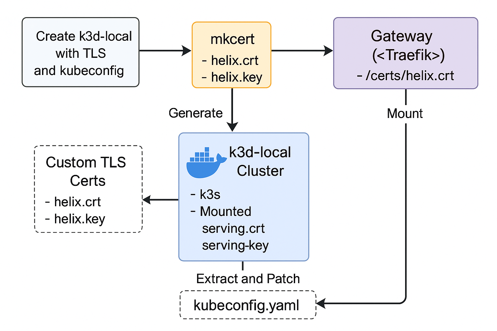

# 🧬 Helix — The DevOps Bootstrap Toolkit

> **Secure, TLS-first, modular Kubernetes infra in a single command.**
> For developers, builders, rebels, and the curious. Built in Bash. Runs on anything.



---

## 🚀 What Is Helix?

**Helix** is your own personal infrastructure butler — a fully-scripted, TLS-secure Kubernetes platform for devs who want **real production features** without real production cloud bills.

Spin up:

* 🔐 Keycloak Identity Hub (with custom themes + realm mounts)
* 🧰 Vault for secrets, sealed & auto-unsealed
* 🛠️ CSI-based TLS cert injection
* ⚙️ Modular add-ons like Portainer, N8N, MinIO, Istio, Kong, and more
* 🧠 Enterprise-grade validation (Popeye, Braille spinners, live dashboards)
* 💬 Interactive Whiptail menus — no YAML editing required

> Perfect for DevOps engineers, indie hackers, security pros, and educators.
> **Built for humans. Powered by trust. Scripted for the future.**

---

## ⚡ Quick Start

```bash
git clone https://github.com/akenel/helix.git
cd helix
./run.sh
```

✅ This will bootstrap a full TLS Kubernetes cluster in `k3d`, deploy Keycloak and Vault with secured certs, and offer a menu to extend the stack — all with zero manual YAML.

---

## 🧱 Core Stack

| Component            | Purpose                                    |
| -------------------- | ------------------------------------------ |
| `k3d`                | Ephemeral local Kubernetes (Docker-backed) |
| `mkcert`             | Dev-trusted TLS CA                         |
| `cert-manager` + CSI | Automated TLS provisioning (pod-level)     |
| `Vault`              | Secrets management with auto-unseal        |
| `Keycloak`           | Identity provider (realm + theme ready)    |
| `whiptail`           | Interactive CLI menus                      |
| `helm`, `jq`, `yq`   | Declarative, scriptable deployment logic   |

---

## 🔐 Identity Stack

### 🎉 Deployed & Validated

* ✅ **Keycloak** with live theming + pre-loaded users (admin/dev/guest/popeye)
* ✅ **Vault** sealed, unsealed, and mounted securely
* ✅ **TLS-first** — every pod gets a valid cert from a local CA
* ✅ **Secrets-safe** — no passwords in YAML or Git
* ✅ **Validation built-in** — Popeye runs HTML reports and alerts

---

## 🔌 Add-On Plugin System

🧩 Simply drop a script in `addons/`, and it will auto-load into the menu.

```bash
# addons/install-n8n.sh
PLUGIN_NAME="n8n"
PLUGIN_DESC="Low-code workflow automation"

run_plugin() {
  helm install n8n oci://ghcr.io/n8n-io/n8n --version 1.0.10 \
    -n automation --create-namespace -f ./addons/n8n/n8n-values.yaml
}
```

Add plugins, install services, upgrade configs — all via Bash.

---

## 🧰 Built-In Features

✅ TLS from the start (mkcert + cert-manager + CSI)
✅ Vault auto-unseal with root token management
✅ Declarative plugin YAMLs with full CLI validation
✅ Live CSI TLS injection to pods
✅ Per-service values, override logic, and full Helm dry-run testing
✅ TUI menus with whiptail and real-time feedback
✅ HTML reports and identity walkthroughs included

---

## 🌐 Accessing Services

| Service   | URL                                                | Notes                           |
| --------- | -------------------------------------------------- | ------------------------------- |
| Keycloak  | [https://keycloak.helix](https://keycloak.helix)   | Login: admin / set at bootstrap |
| Vault     | [https://vault.helix](https://vault.helix)         | Token in `vault-init.log`       |
| Portainer | [https://portainer.helix](https://portainer.helix) | UI deployed, no ingress yet?    |
| Popeye    | HTML report in `/reports/`                         | View system health in-browser   |

> 💡 If `*.helix` domains return 404, check for missing ingress routes and ensure `/etc/hosts` points them to `127.0.0.1`.

---

## ⚙️ Setup Requirements

### Prerequisites:

```bash
brew install mkcert helm jq yq k3d
mkcert -install
```

### Then:

* 🐳 Ensure Docker is running
* 🌍 Run Chrome/Firefox once (for cert store setup)
* 🔄 Run `helm repo update`

---

## 🎨 Add Your Own Plugin

Helix supports self-discovery of add-ons by file name and plugin name.

1. Create a folder in `bootstrap/addon-configs/<your-plugin>/`
2. Drop a `*-values.yaml` file inside
3. Run the add-on wizard or add to `services.yaml`
4. Deploy from the Whiptail menu or CLI

---

## 📖 Example Plugin Entry

```yaml
- name: portainer
  description: "Docker UI for Kubernetes"
  enabled: true
  namespace: portainer
  values_file: bootstrap/addon-configs/portainer/portainer-values.yaml
  helm_chart_repo: portainer
  helm_chart_name: portainer
  helm_chart_version: 1.0.69
  helm_release_name_override: portainer
```

---

## 🧪 CSI TLS Volume Example

```yaml
volumes:
- name: tls
  csi:
    driver: csi.cert-manager.io
    readOnly: true
    volumeAttributes:
      csi.cert-manager.io/issuer-name: mkcert-ca-issuer
      csi.cert-manager.io/issuer-kind: ClusterIssuer
      csi.cert-manager.io/dns-names: keycloak.helix
```

---

## 🧭 Roadmap

* [x] TLS cluster bootstrap
* [x] Vault & Keycloak identity integration
* [x] CSI TLS volume injection
* [x] Add-on framework with YAML plugin discovery
* [x] Popeye HTML validation output
* [ ] Realm & theme import automation
* [ ] GitHub CI bootstraps + nightly validations
* [ ] Plugin ecosystem + community gallery

---

## 👥 Contributing

We welcome **plugins, docs, feedback, and ideas**.

```bash
git checkout -b feature/my-addon
```

Submit a plugin or fix to `addons/`, and we’ll review it.
Let’s make beautiful infrastructure — together.

---

## 🔐 License

Licensed under the **MIT License**
Contact for secure white-label enterprise builds or consulting:

📧 [theSAPspecialist@gmail.com](mailto:theSAPspecialist@gmail.com)
🔗 [linkedin.com/in/theSAPspecialist](https://www.linkedin.com/in/theSAPspecialist)
🎥 YouTube: [@theSAPspecialist](https://www.youtube.com/@theSAPspecialist)

---

## 🧠 Why Helix?

Because real infrastructure:

* Should be secure by default.
* Should be readable and learnable.
* Should cost **\$0** to explore and understand.
* Should work **offline**, with no vendor lock-in.

Helix gives you **identity, secrets, TLS, add-ons, themes, and validation** —
**all without a control plane or cloud bill.**

---

## 🥋 Chuck Norris Approved

> Because no system is secure… until Chuck says so.


---

**Helix**:
*Modern infrastructure, bootstrapped from scratch, fully owned by you.*
