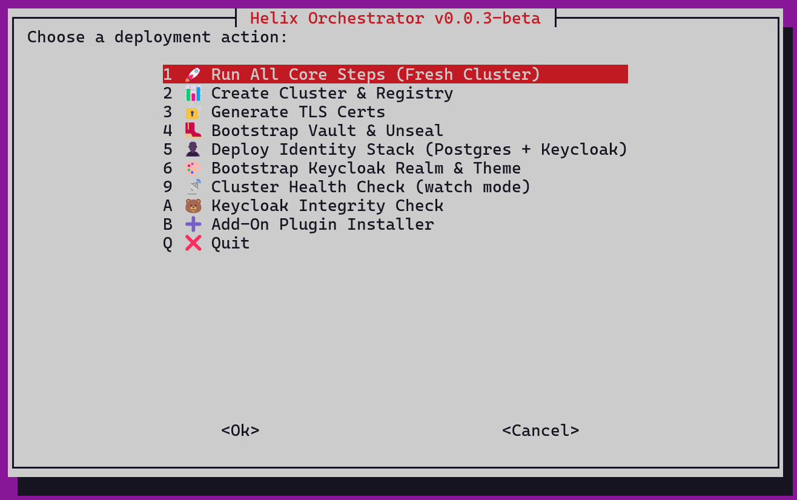

## 🎛️ Helix Platform Launcher (`helixctl`)

A unified command-line tool to manage and inspect the Helix identity & security platform.

| Command              | Description                                               |
|----------------------|-----------------------------------------------------------|
| `helixctl --init-realm`      | Bootstrap Keycloak realm and clients              |
| `helixctl --init-users`      | Create default users and assign roles             |
| `helixctl --export-secrets`  | Store Keycloak client secrets in Vault            |
| `helixctl --health`          | Run a full cluster, identity, and TLS audit       |
| `helixctl --verify-helm`     | Check status of Keycloak, Portainer, Vault releases |
| `helixctl --check-vault-agent` | Verify Vault Injector webhook health           |
| `helixctl --help`            | Show CLI help and banner                          |

> You can alias it: `alias helixctl='./wiki/helix-platform-menu.sh'`
